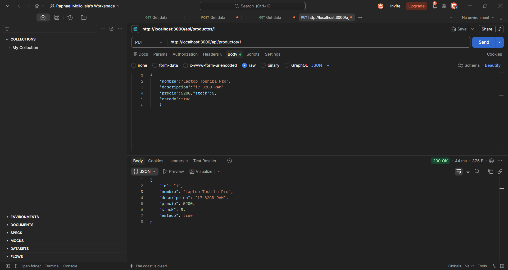

# Gestión de Productos - Backend API

**Estudiante:** Emerson Mollo (Jhosep-M) — Emerson Raphae Mollo Isla  
**Materia:** Programación Web II — Universidad Privada Domingo Savio (UPDS)  
**Proyecto:** Primer Parcial Práctico — API REST para gestión de productos con persistencia real en SQL Server

## Descripción

API REST construida con Node.js + Express + Sequelize que expone un CRUD completo sobre la entidad `Producto`. Todos los datos se persisten realmente en SQL Server (LocalDB o instancia SQL Server) vía Sequelize dialecto `mssql`. Arquitectura por capas: `Route → Controller → Model → Sequelize → SQL Server`. Sin arrays en memoria ni mocks.

## Tecnologías

- Node.js + Express 5.2.1
- Sequelize 6.37.8
- SQL Server (LocalDB `MSSQLLocalDB` o SQL Server estándar) — dialecto `mssql`, drivers `tedious` + `msnodesqlv8` (ODBC Driver 17)
- dotenv, cors
- Postman para pruebas


## Instalación paso a paso

### 1. Crear una carpeta

```bash
mkdir Examen1WEB2
cd Examen1WEB2/backend
npm install
```

### 2. Configurar `.env`

```bash
cp .env.example .env
# Editar .env con tus credenciales
```

**Para LocalDB (Windows, por defecto en laboratorio):**
```ini
DB_HOST=(localdb)\MSSQLLocalDB
DB_USER=(localdb)\MSSQLLocalDB
DB_PASSWORD=
DB_NAME=WEB2DB
DB_PORT=1433
PORT=3000
```

**Para SQL Server con usuario SQL:**
```ini
DB_HOST=localhost
DB_USER=sa
DB_PASSWORD=tuContraseña123
DB_NAME=WEB2DB
DB_PORT=1433
# DB_INSTANCE=SQLEXPRESS   # descomentar si usas instancia con nombre
PORT=3000
```

### 3. Crear la base de datos

Opción A — automática: al iniciar el servidor, `sequelize.sync({ alter:true })` crea la tabla si no existe.

Opción B — manual con script:
```bash
sqlcmd -S "(localdb)\MSSQLLocalDB" -i script.sql
# o ejecutar script.sql en SSMS / Azure Data Studio
```

Verificar:
```sql
SELECT * FROM Productos;
```

### 4. Levantar el servidor

```bash
npm start
# o en desarrollo
npm run dev
```

Debe verse:
```
✔ Conexión a SQL Server establecida correctamente.
✔ Tablas sincronizadas correctamente (Productos).
✔ Servidor escuchando en http://localhost:3000
```

Probar salud: `GET http://localhost:3000/` → 200 con info de endpoints.

## Endpoints — Base `http://localhost:3000/api/productos`

| Método | Ruta | Descripción | Éxito | Error |
|--------|------|-------------|-------|-------|
| GET | `/` | Listar todos | 200 `[]` o array | 500 |
| GET | `/:id` | Por ID | 200 producto | 404 `{ mensaje: "Producto no encontrado" }` |
| POST | `/` | Crear | 201 producto con id | 400 validación, 500 |
| PUT | `/:id` | Actualizar | 200 producto | 400, 404, 500 |
| DELETE | `/:id` | Eliminar físico | 200 `{ mensaje: "Producto eliminado correctamente" }` | 404, 500 |
| GET | `/buscar?nombre=texto` | Búsqueda LIKE parcial | 200 `[]` o array (nunca 404) | 500 |

**Validaciones POST/PUT:**
- `nombre` obligatorio, no vacío → 400 `{ mensaje: "El campo nombre es obligatorio" }`
- `precio` obligatorio, numérico, > 0 → 400
- `stock` obligatorio, entero, >= 0 → 400

**Nota de rutas:** `/buscar` está declarado **antes** que `/:id` en `productoRoutes.js` para que Express no interprete `buscar` como id.


```

## Pruebas en Postman

1. Importar `postman/Productos_API.postman_collection.json` en Postman.
2. Ejecutar en orden: Listar → Crear válido → Obtener :id → Buscar → Actualizar → Eliminar.
3. Casos de error incluidos: 400 sin nombre, precio 0, stock -1; 404 id 9999 para GET/PUT/DELETE; búsqueda sin coincidencias → 200 [].

Evidencias a capturar:
- GET lista

- GET por ID (200)

- GET por ID inexistente (404)

- POST válido (201) + verificación `SELECT * FROM Productos;`


- POST inválido (400)
- PUT válido (200) + verificación SELECT
- DELETE (200) + verificación SELECT
- Buscar con y sin resultados (200)

## Verificación de persistencia real

Después de cada POST/PUT/DELETE, ejecutar en SSMS o sqlcmd:

```sql
SELECT * FROM Productos;
```

Debe reflejar exactamente el estado tras la operación Postman, demostrando que no hay almacenamiento en memoria.

## Flujo de la API

```
Petición HTTP → Express (cors, json) → Route (/api/productos) → Controller → Model (Sequelize) → SQL Server
```

## Checklist de rúbrica

- [x] Estructura exacta `backend/` con 8 archivos base
- [x] Sin arrays/mocks, todo vía Sequelize
- [x] `.env` en `.gitignore`, existe `.env.example`
- [x] 6 endpoints con códigos correctos y persistencia real
- [x] Validaciones nombre/precio/stock → 400
- [x] `buscar` antes de `:id`
- [x] README completo
- [x] script.sql incluido
- [x] Colección Postman incluida
- [x] `sequelize.authenticate()` + `sync()` con logs claros


